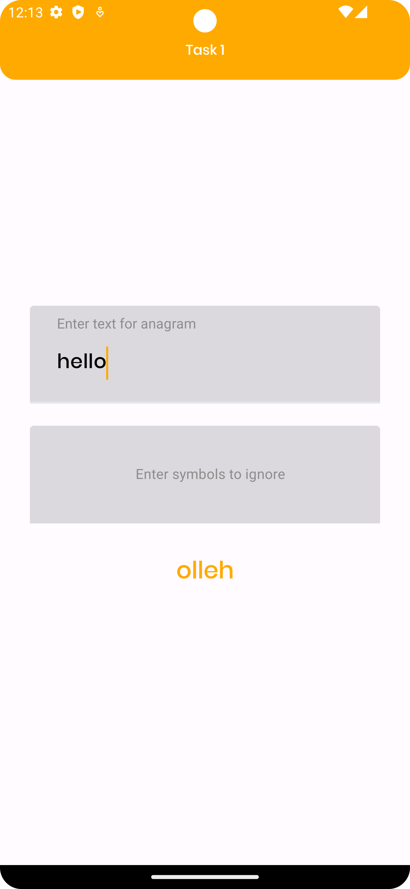
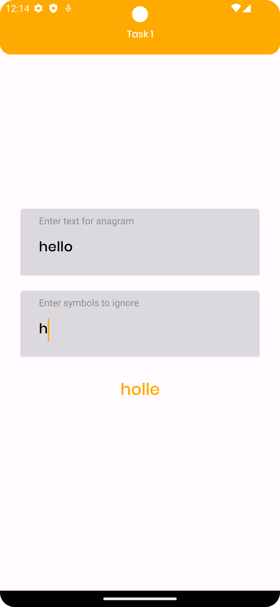
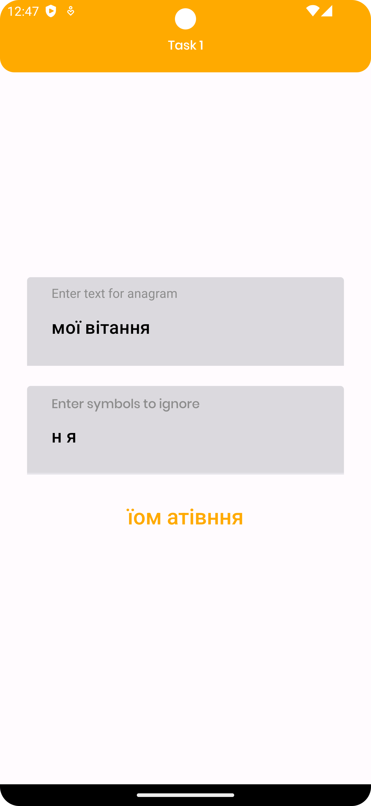
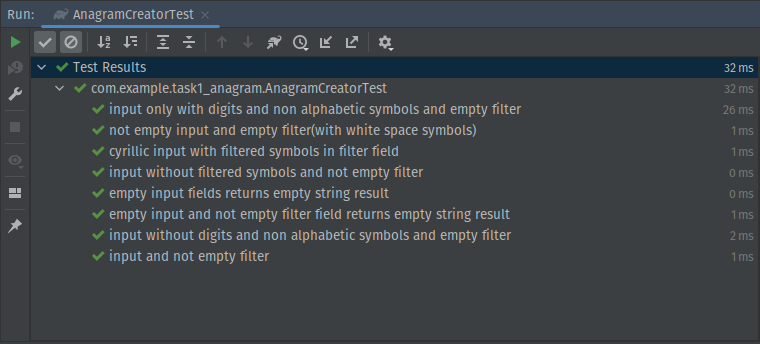

Hi, my name is Andrii, and welcome to the Anagram creator project!

## What I used in this project:

- Java, Kotlin
- Android Framework
- JUnit
- Espresso

An anagram is a word or phrase formed by rearranging the letters of a different word or phrase, typically using all the original letters exactly once. (from Wikipedia)

## Project overview:

When you first open the app, you'll see a screen with two fields and an empty text field for the result:

Users can enter the word for creating an anagram. If text with filtering symbols is empty, then ignored symbols are digits and non-alphabetic symbols

If text with filtering symbols is not empty, then ignored symbols are entered by the user

It's also works for Cyrillic input:

Creation of anagram - automatic. The user immediately sees the result.

Also, I have unit tests for this project:

and UI tests using the Espresso framework:

Thank you for your interest in my project. Feel free to explore the code and project structure. If you have any questions or suggestions, please don't hesitate to reach out!

My contacts:

[LinkedIn](https://www.linkedin.com/in/andrii-seleznov-32142721a/)

[Email](https://mail.google.com/mail/?view=cm&to=seleznov.andriy@gmail.com) 
